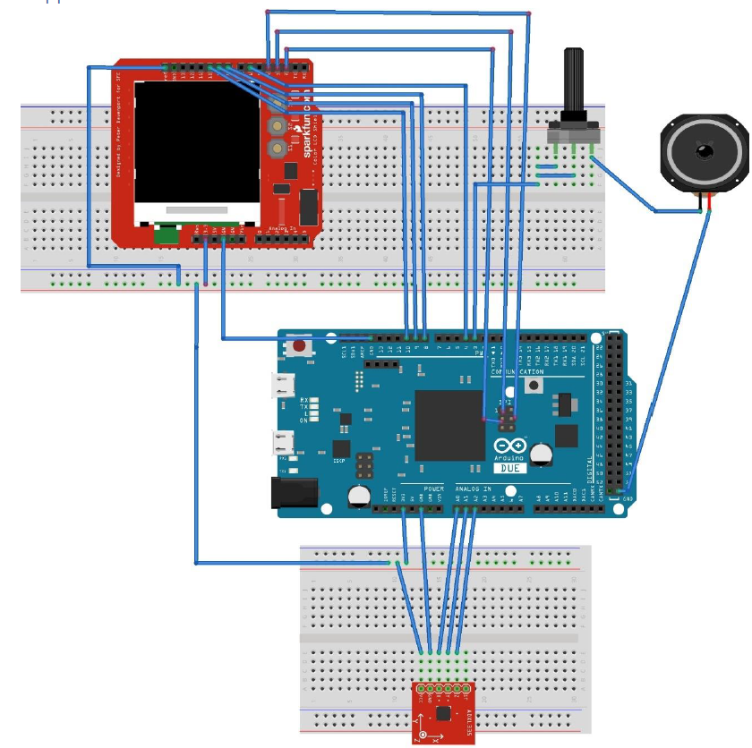
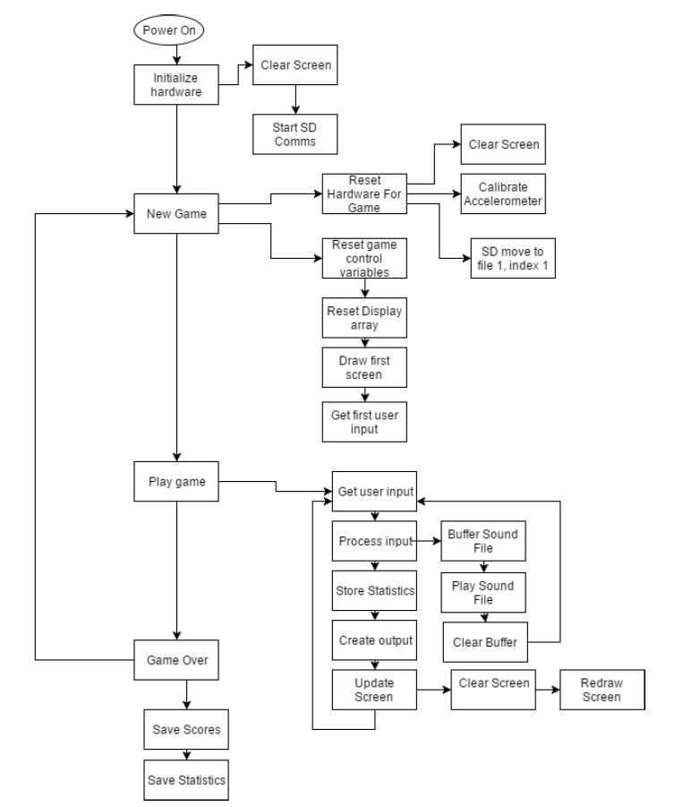

# Arduino Space Invaders (formerly Game Thing 2.0)

> A version of the famous Space Invaders that runs on an Arduino

This is the repository for our take on Space Invaders running on an Arduino Due (SAM3X8E). While not all features are present, the final version of the  game can play music while running the game, generates new levels randomnly, increases difficulty as you progress, saves high scores, keeps track of lives and can measure acurrately the user’s
accuracy while playing. This project utilizes a complex finite state machine (FSM) as the main game engine. It is constantly updating the screen as well as all the other variables. Further improvements can be done with the use of a display with a faster refresh rate.

**[Video of it Working](https://www.youtube.com/watch?v=ut6ba_G9qIc)**

## Requirements

* Arduino Due
* Adafruit ST7735 Colour LCD
* 3-Axis Accelerometer Module for Arduino
* 0.25 W 8Ohm Speaker
* 50K Ohm variable resistor
* 4 Gb microSD card

## Running
1. Wire everyhting as in the schematic.

2. Compile and upload **Arduino-Game-Console.ino** to your Arduino Due.
3. Have Fun! (Control with accelerometer)

# Software Design

If you are curious on how everythin runs, here is an useful flowchart:

## Meta

* **Luis M.**           - [GitHub](https://github.com/lemontyc)
* **Reuben L.**

Distriuted under the MIT License. See ``LICENSE`` for more information.

This project was developed for the **ELEC3607/9607-Embedded Systems** course at **The University of Sydney**.
